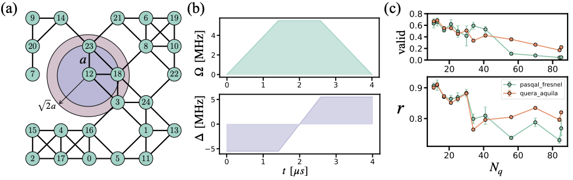

# Benchmarking neutral atom-based quantum processors at scale

In recent years, neutral atom-based quantum computation has been established as a competing alternative for the realization of fault-tolerant quantum computation. However, as with other quantum technologies, various sources of noise limit their performance. With processors continuing to scale up, new techniques are needed to characterize and compare them in order to track their progress. In this work, we present two systematic benchmarks that evaluate these quantum processors at scale. We use the quantum adiabatic algorithm (QAA) and the quantum approximate optimization algorithm (QAOA) to solve maximal independent set (MIS) instances of random unit-disk graphs. These benchmarks are scalable, relying not on prior knowledge of the system's evolution but on the quality of the MIS solutions obtained. We benchmark **quera_aquila** and **pasqal_fresnel** on problem sizes up to *102* and *85* qubits, respectively. Overall, **quera_aquila** performs better on QAOA and QAA instances. Finally, we generate MIS instances of up to 1000 qubits, providing scalable benchmarks for evaluating future, larger processors as they become available.

**Paper:** [https://arxiv.org/abs/2511.22967](https://arxiv.org/abs/2511.22967)

## Repository Structure and Contents

This repository provides notebooks, scripts, and data relevant to benchmarking experiments for neutral atom quantum processing units (QPUs). Below is an overview of the main files and directories:

- **Data/**  
  Directory containing datasets and raw data used for benchmarking neutral atom QPUs.

- **Figures-paper.ipynb**  
  Jupyter notebook for generating publication-ready figures summarizing benchmarking results.

- **Figures.ipynb**  
  Jupyter notebook for creating and visualizing various benchmarking figures and analysis plots.

- **Figures/**  
  Directory containing figures and visualizations referenced in notebooks or produced during experiments.

- **QAA_Braket.ipynb**  
  Notebook implementing benchmarking using Quantum Approximate Optimization Algorithms (QAA) on Amazon Braket neutral atom devices.

- **QAA_Pulser.ipynb**  
  Benchmarking notebook for QAA on Pulser, a pulse-level neutral atom quantum simulation library.

- **QAOA_Braket.ipynb**  
  Jupyter notebook for benchmarking Quantum Approximate Optimization Algorithm (QAOA) on Amazon Braket neutral atom hardware.

- **QAOA_Pulser.ipynb**  
  Notebook for QAOA benchmarking using the Pulser library.

- **greedy_bitflips.ipynb**  
  Notebook exploring greedy bit-flip algorithms and their impact on quantum device performance and benchmarking.

- **prepare_problems.ipynb**  
  Jupyter notebook for generating and setting up optimization problem instances used as input for benchmarking algorithms.

- **requirements.txt**  
  File listing Python package dependencies required to run the notebooks in this repository.

- **utils.py**  
  Python utility script containing helper functions for data manipulation and analysis as used in other notebooks.

- **.DS_Store**, **__pycache__/**  
  System and runtime files; can be ignored or safely deleted.

## Getting Started

1. Install Python dependencies found in `requirements.txt` with `pip install -r requirements.txt`.
2. Open and explore the Jupyter notebooks (`.ipynb` files) for guided analysis and benchmarking workflows.
3. Refer to the `Data/` folder for datasets and the `Figures/` folder for output figures.

## Purpose

This repository aims to provide reproducible workflows and transparent methodology for benchmarking neutral atom QPU devices and simulators, supporting comparative analysis and experimental reproducibility.

##
